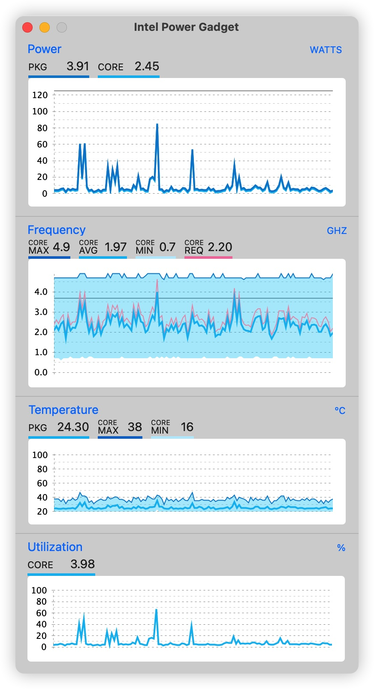
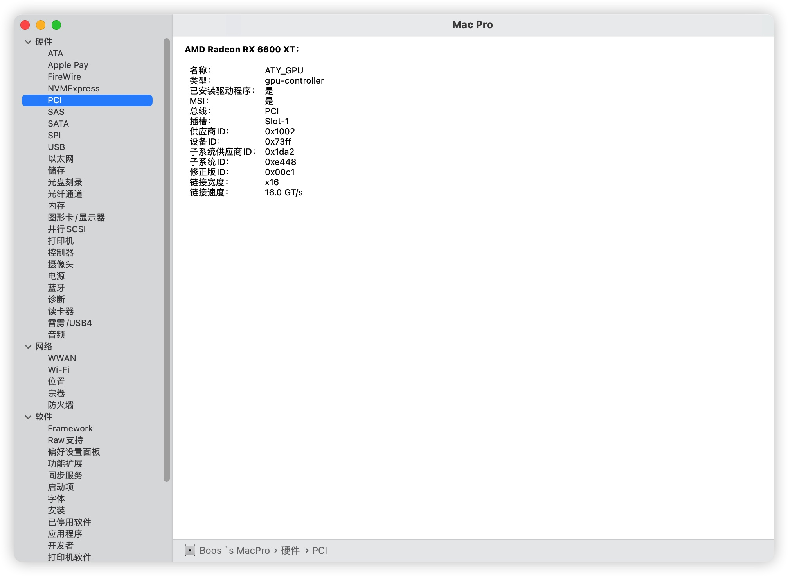

# OpenCore 0.8.8

|             |                                                              |                               |
| ----------- | ------------------------------------------------------------ | ----------------------------- |
| MotherBoard | JINGYUE-B660i-Snow-Dream                                              | [My Bios](bios.bin)                      |
| CPU         | I5-12600KF                                                      | 10C16T                          |
| Memory      | CJR 4000 Mhz                                               | 16G*2                          |
| GPU         | AMD Radeon RX 6600XT 8 GB               |  NITRO+   |
| WIFI        | AX201                                                  | WIFI 6 3Gbps / BT 5.2 |
| Ethernet    | 8125B / 8111H                                                 |                               |
| Disk        | Dahua C900 Plus / J.ZAO QL | Enable **TRIM**               |

## Guide
Flash meme BIOS and use EFI  
Abt Sleep **WORKS** Check Video below

## Known issues
**Type-c** `bcz i dont use this feature`  

## Feature
Turbo boost 4.9G

Cpu infomation

